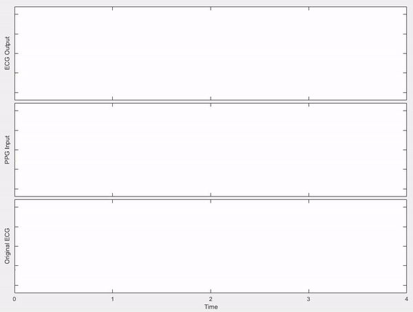
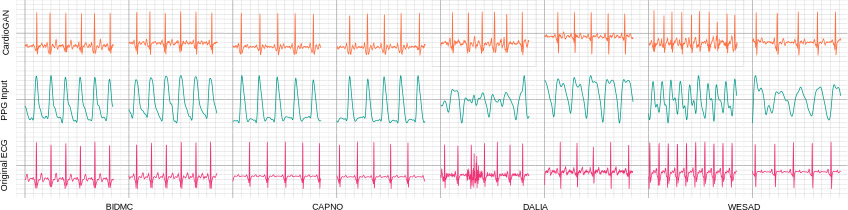
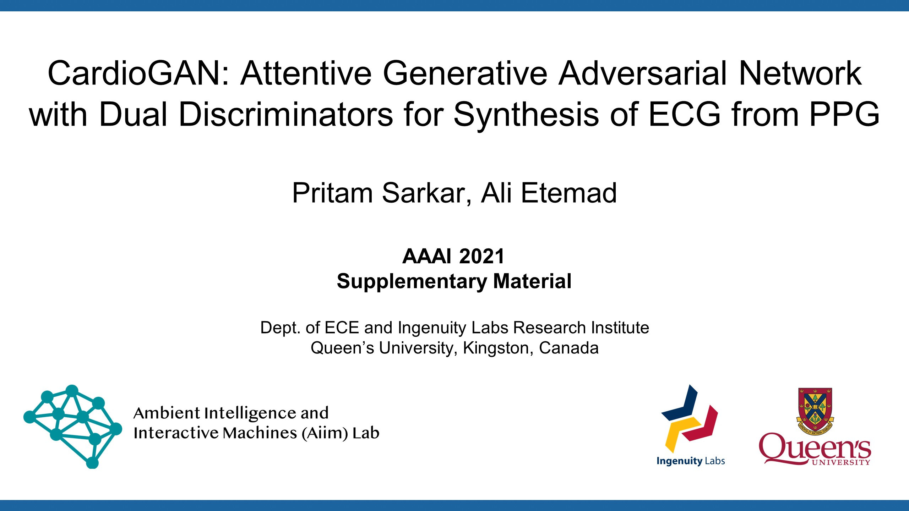

<p align="center"> 
 
</p>

### CardioGAN: Attentive Generative Adversarial Network with Dual Discriminators for Synthesis of ECG from PPG
### Authors: [Pritam Sarkar](https://www.pritamsarkar.com) and [Ali Etemad](https://www.alietemad.com)
## [Paper](https://arxiv.org/pdf/2010.00104.pdf) - [Repository](https://github.com/pritamqu/ppg2ecg-cardiogan) - [Project Page](https://pritamqu.github.io/ppg2ecg-cardiogan/)

<hr style="height:1px" />



### Datasets
- [BIDMC](https://physionet.org/content/bidmc/1.0.0/)
- [CAPNO](http://www.capnobase.org/)
- [DALIA](https://archive.ics.uci.edu/ml/datasets/PPG-DaLiA)
- [WESAD](https://archive.ics.uci.edu/ml/datasets/WESAD+%28Wearable+Stress+and+Affect+Detection%29)

### Prerequisites
- Tensorflow v2.2
- Numpy
- Scikit-learn
- OpenCV
- Scipy
- Tqdm
- Pandas
- h5py

### Test
We provide the weights for CardioGAN, trained on the four public datasets mentioned above. The sample code can be used to convert PPG signals to ECG.
[link to download weights](./weights)
```
test_cardiogan.py
```
### Application
 To develop a realtime application using our proposed method, we utilize an [Empatica E4](https://e4.empatica.com/e4-wristband) to collect and transfer PPG to a computer. Our model then converts 4-second segments of input PPG to synthetic ECG.
```
cardiogan_realtime.py
```
Please see a **live demonstration** using this link. [](https://youtu.be/z0Dr4k24t7U)


### Additional Materials
- My AAAI presentation can be found here: https://youtu.be/npMzbIfkVuo.
- Please check my slides here at: https://www.slideshare.net/PritamSarkar8/cardiogan
<!-- - The poster displayed at AAAI-21 is availble here: https://www.slideshare.net/PritamSarkar8/cardiogan-poster> -->

### Media Coverage/Articles
- [Medium article](https://srisruthichilukuri.medium.com/synthesizing-electrocardiogram-ecg-from-photoplethysmogram-ppg-using-generative-adversarial-60c9724d9e70)
- [Queen's article](https://engineering.queensu.ca/news/2021/08/queens-engineering-researchers-identify-an-accessible-affordable-means-to-continuously-monitor-cardiac-health.html?fbclid=IwAR2QkogcWjQwAMom-JSECyubSj9a_0LV9pFE1lYtZEIQwv5a-ewqC-DSAas)


### Citation
Please cite our paper below when using or referring to our work.
```
@misc{sarkar2020cardiogan,
      title={CardioGAN: Attentive Generative Adversarial Network with Dual Discriminators for Synthesis of ECG from PPG}, 
      author={Pritam Sarkar and Ali Etemad},
      year={2020},
      eprint={2010.00104},
      archivePrefix={arXiv},
      primaryClass={cs.LG}
}
```

### Acknowledgments
Some parts of our code has been borrowed from [CycleGAN TF v2](https://github.com/LynnHo/CycleGAN-Tensorflow-2).

<!---
### Media Coverage
- [medium.com](https://srisruthichilukuri.medium.com/synthesizing-electrocardiogram-ecg-from-photoplethysmogram-ppg-using-generative-adversarial-60c9724d9e70)
-->

### Question
 If you have any questions or would like to discuss our work, please contact me at <pritam.sarkar@queensu.ca> or connect with me on [LinkedIN](https://www.linkedin.com/in/sarkarpritam/).
